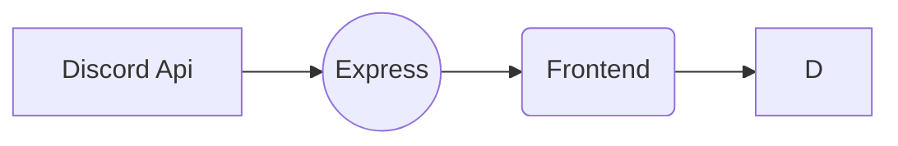

# Discord Auth with express and React

> setting up

- open backend/.env add add following data.

  | NAME                  | VALUE                                              |
  | --------------------- | -------------------------------------------------- |
  | DISCORD_CLIENT_ID     | `bot discord id.`                                  |
  | DISCORD_CLIENT_SECRET | `bot discord secret.`                              |
  | CALLBACK_URL          | `default "http://localhost:**PORT**/api/callback"` |
  | WEB                   | `default "http://localhost:**FRONTEND PORT**"`     |

**Flow Chart of this project**

