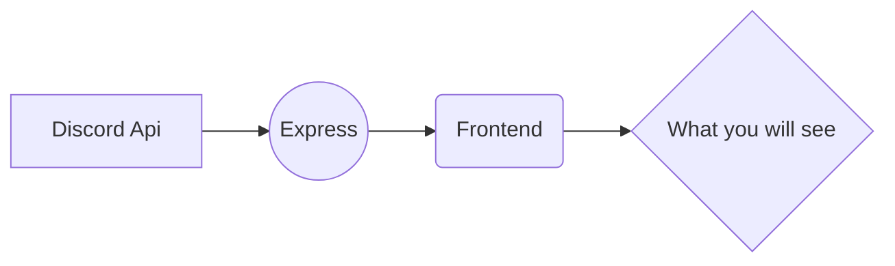

# Discord Auth with express and React

> **setting up backend**

- open backend/.env add add following data.

  | NAME                  | VALUE                                          |
  | --------------------- | ---------------------------------------------- |
  | DISCORD_CLIENT_ID     | `bot discord id.`                              |
  | DISCORD_CLIENT_SECRET | `bot discord secret.`                          |
  | CALLBACK_URL          | `default "http://localhost:PORT/api/callback"` |
  | WEB                   | `default "http://localhost:FRONTEND_PORT"`     |

> **Setting up Frontend**

- open frontend/.env
  | NAME | VALUE |
  | --------------------- | ---------------------------------------------- |
  | REACT_BACKEND_URL | `default "http://localhost:BACKEND_PORT"` |

**Flow Chart of this project**

